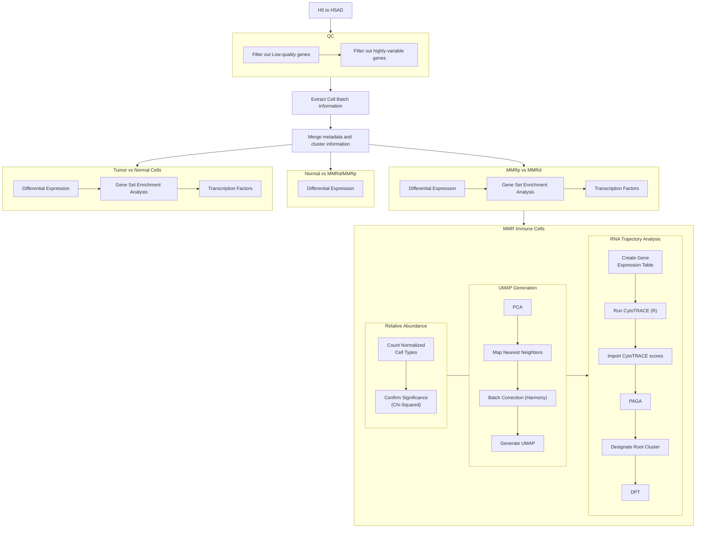

<!-- https://mermaid.live/edit -->

```mermaid
flowchart TD
    A[H5 to H5AD]

    subgraph QC_Process [QC]
        B1[Filter out Low-quality genes] --> B2[Filter out highly-variable genes]
    end

    C[Extract Cell Batch information]
    D[Merge metadata and cluster information]

    %% First branch: MMRp vs MMRd
        subgraph MMR [MMRp vs MMRd]
            E1[Differential Expression] 
            E1 --> E2[Gene Set Enrichment Analysis]
            E2 --> E3[Transcription Factors]
        end
        MMR --> Comparison_MMR
    subgraph Comparison_MMR [MMR Immune Cells]
        subgraph RA [Relative Abundance]
            R1[Count Normalized<br>Cell Types]
            R1 --> R2["Confirm Significance<br>(Chi-Squared)"]
        end
        %% Sub-branch: MMR Immune Cells Analysis
        subgraph Immune_Analysis [UMAP Generation]
            F2[PCA]
            F2 --> F3[Map Nearest Neighbors]
            F3 --> F4["Batch Correction (Harmony)"]
            F4 --> F5[Generate UMAP]
        end
        
        RA --- Immune_Analysis
        
        %% Sub-branch: RNA Trajectory Analysis
        subgraph RNA_Trajectory [RNA Trajectory Analysis]
            G1[Create Gene<br>Expression Table] --> G2["Run CytoTRACE (R)"]
            G2 --> G3[Import CytoTRACE scores]
            G3 --> G4[PAGA]
            G4 --> G5[Designate Root Cluster]
            G5 --> G6[DPT]
        end
        
        %% Link subgraphs to the MMRp vs MMRd flow
        %% E3 --> Immune_Analysis
        Immune_Analysis --> RNA_Trajectory
    end

    %% Second branch: Normal Tissue vs MMRd/MMRp
    subgraph Tissue_Comparison [Normal vs MMRd/MMRp]
        H1[Differential Expression]
    end

    %% Third branch: Tumor vs Normal Cells
    subgraph Tumor_Comparison [Tumor vs Normal Cells]
        I1[Differential Expression] --> I2[Gene Set Enrichment Analysis] --> I3[Transcription Factors]
    end

    %% Main flow
    A --> QC_Process
    QC_Process --> C
    C --> D

    %% Branching points from merged metadata
    D --> Tumor_Comparison
    D --> Tissue_Comparison
    D --> MMR
```